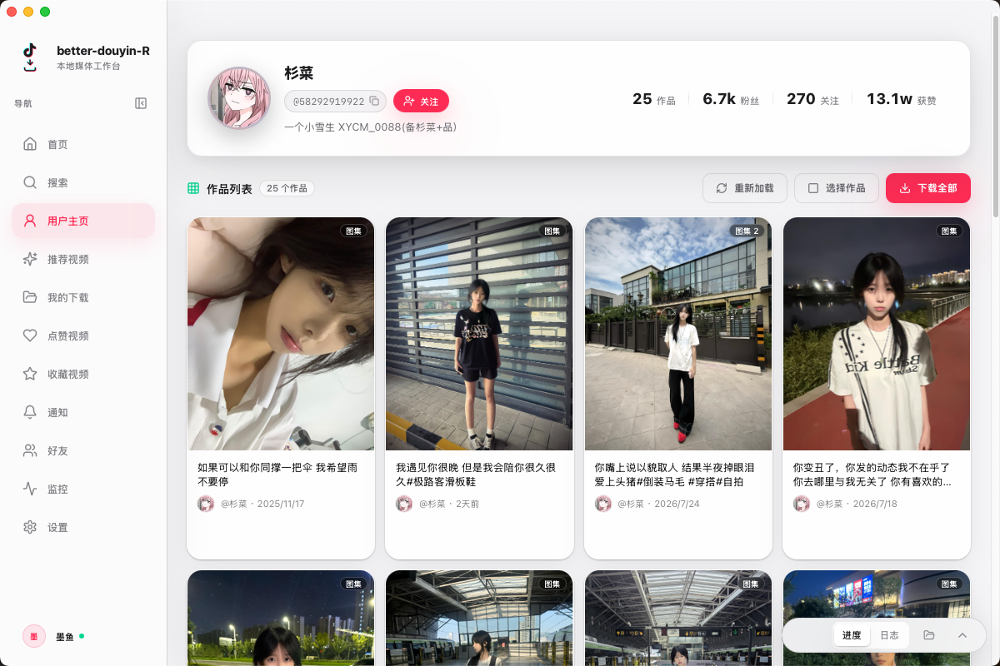
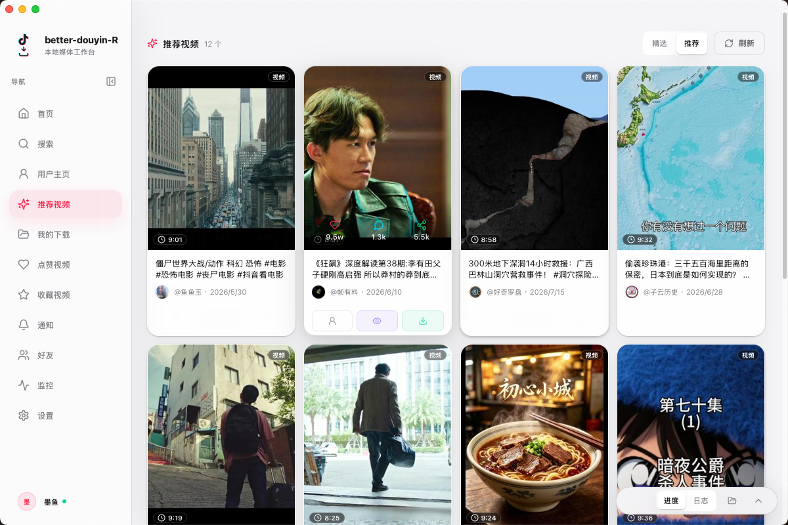
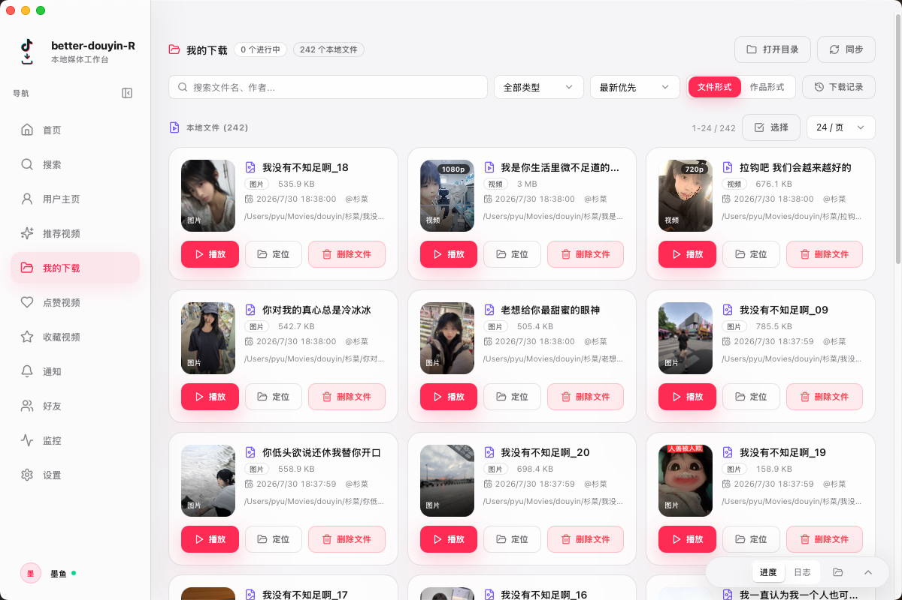
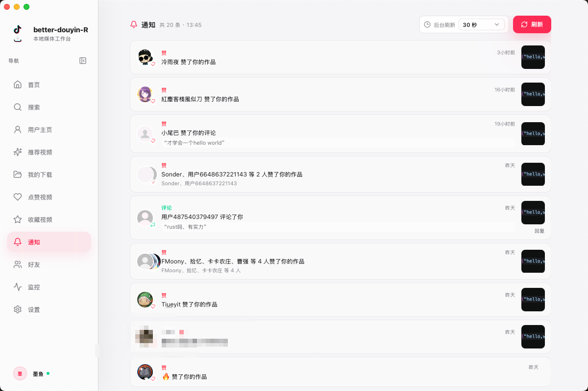
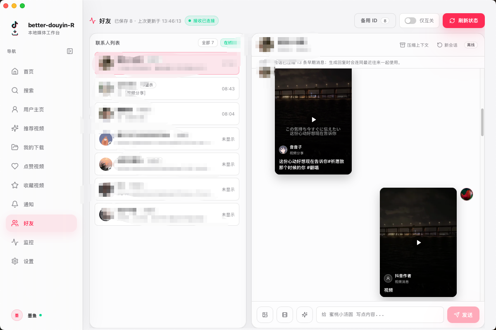
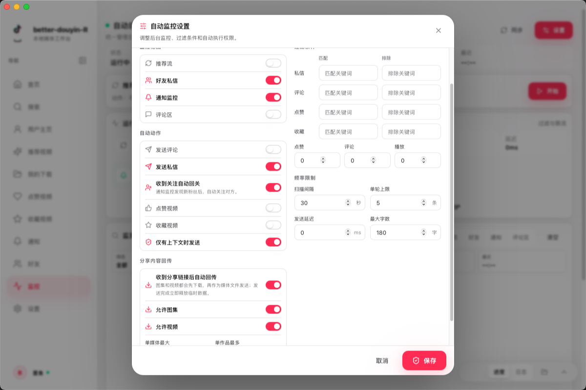
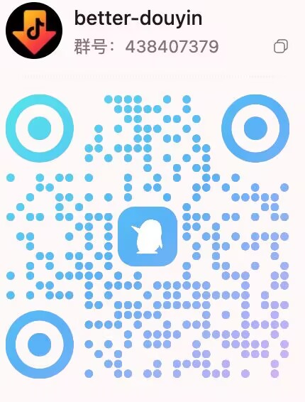

> [!IMPORTANT]
> **迁移说明：Rust / Tauri 版本现在正式迁移到 `anYuJia/better-douyin` 作为主发布仓库。**
>
> 如果你来自旧仓库 [`anYuJia/better-douyin-R`](https://github.com/anYuJia/better-douyin-R) 或旧版本，请前往本仓库的 [Releases](https://github.com/anYuJia/better-douyin/releases/latest) 重新下载安装包。后续安装包、签名文件和自动更新 metadata 都会在这里发布。
>
> 另外，因为作者误操作，原仓库的 Star 数据全部丢失了。如果这个项目对你有帮助，希望大家在新仓库帮忙点一个 Star 支持作者：[https://github.com/anYuJia/better-douyin](https://github.com/anYuJia/better-douyin)。非常感谢！

<div align="center">


# better-douyin

更轻、更快的 Rust / Tauri 版抖音桌面工具。公开源码保留前端 UI、mock bridge、mock backend 和协作边界；完整可用应用请下载 Releases。

<p>
  <a href="https://github.com/anYuJia/better-douyin/releases/latest"></a>
  <a href="https://github.com/anYuJia/better-douyin/releases"></a>
  <a href="https://github.com/anYuJia/better-douyin/stargazers"></a>
  
  
  
  
  
  <a href="LICENSE"></a>
</p>

[下载完整应用](#下载完整应用) · [许可协议](#许可协议) · [功能能力](#功能能力) · [界面预览](#界面预览) · [源码说明](#源码说明) · [协作边界](#协作边界)

</div>

---

## 项目定位

better-douyin 是 better-douyin 的 Rust / Tauri 桌面版本，重点放在更轻的运行时、更稳定的本地播放、更顺滑的桌面体验和更可靠的跨平台分发。

需要直接使用完整功能的用户，请从 [Releases](https://github.com/anYuJia/better-douyin/releases/latest) 下载发行版。发行版是完整应用；当前公开源码是 **Open Shell**，用于展示 UI、组件结构、mock 流程和协作边界。

公开源码适合：

- 了解产品界面、交互和前端架构
- 改进 UI / UX、主题、组件、响应式和可访问性
- 给其他 AI 或协作者提供安全上下文
- 基于同一前端契约接入你自己有权维护的服务

公开源码不包含真实平台连接器、签名、Cookie、加密、真实接口、下载解析或发布密钥。

## 下载完整应用

完整应用在 [Releases](https://github.com/anYuJia/better-douyin/releases/latest) 发布。普通用户建议直接下载 Release，不需要从源码构建。

Release 附带 `checksums.sha256` / `checksums.json`，可用于核对安装包 Hash，避免下载到第三方篡改版本。

## 许可协议

本公开版本采用项目根目录 [LICENSE](LICENSE) 中的 **Better Douyin Non-Commercial License** 授权，仅允许个人在非商业的学习、研究、学术探讨和测试等场景中使用、复制、学习和修改。

未经著作权人事先书面许可，禁止任何形式的商业分发、收费下载或代下载、付费镜像、托管 / SaaS / 代部署服务、商业集成、数据销售，以及其他直接或间接营利性使用。

使用者应自行遵守相关平台规则，并自行承担因使用方式、账号环境、请求频率、平台策略变化等导致的账号异常、风控验证、限流、封禁、封号、内容不可用、数据丢失或其他损失。作者不提供规避平台风控、解封、恢复账号或规避限制的支持。

## 功能能力

以下为完整发行版能力。公开源码仅保留 UI、mock bridge、mock backend 与协作边界，用于体验界面和二次开发，不包含真实平台连接器。

### 内容获取与浏览

- 首页提供搜索用户、解析链接、推荐视频、收藏视频等快捷入口，并汇总本地下载统计。
- 支持按昵称、抖音号、UID 搜索用户，查看用户资料、作品列表、粉丝 / 关注 / 获赞等信息。
- 支持粘贴抖音分享链接、短链接或完整作品 URL，解析单条视频、图集和部分 Live Photo 内容。
- 支持浏览用户作品、推荐视频、点赞视频、收藏视频、收藏合集和合集内作品。
- 推荐流支持精选 / 推荐切换、滚轮浏览、快速播放、一键下载和批量下载。

### 下载与本地管理

- 支持下载单个作品、用户作品、搜索结果、推荐流、点赞列表、收藏列表和收藏合集。
- 下载任务支持队列进度、实时日志、暂停 / 恢复 / 取消、失败提示和重复文件跳过。
- 支持按作者或合集归档，配置下载目录、作者目录规则、文件命名模板、并发数和下载质量。
- 支持 Live Photo 静图 / 视频保存选项、视频原声 / BGM 保存，并写入下载任务和下载记录。
- “我的下载”支持文件视图 / 作品视图、搜索、筛选、分页、播放、定位到文件、删除文件和目录同步。

### 播放、互动与自动化

- 沉浸式播放器支持视频 / 图集切换、进度控制、音量、倍速、清晰度切换、自动播放下一条和失败重试。
- 播放器内可进行下载、点赞、收藏、分享、查看评论、定位通知来源评论和生成评论草稿。
- 通知中心可展示点赞、评论、关注等互动通知，支持后台刷新、刷新间隔设置和通知跳转。
- 好友模块支持好友列表、在线状态、关注列表、私信会话、历史同步、未读提醒和分享卡片展示。
- AI 互动支持配置 OpenAI Compatible 等服务商，用于生成评论、私信回复和内容分析。
- 自动监控支持推荐流、好友私信、通知、评论区和创作者作品更新，提供关键词过滤、阈值、扫描间隔、单轮上限和自动动作日志。
- 在用户显式开启后，可执行自动评论 / 私信草稿、自动点赞、自动收藏、关注后回关和收到分享后回传媒体等流程。

### 桌面与扩展

- Cookie、账号、配置、下载历史、缓存和本地文件均保存在本机。
- 支持内置登录、手动 Cookie、账号状态校验、多账号切换和账号删除。
- Rust / Tauri 版提供更轻的桌面运行时、原生窗口、侧边栏展开 / 收起、小屏适配和更稳定的本地播放体验。
- 提供本机 HTTP MCP 服务，让 Codex、Claude Code、OpenClaw 等 AI 工具在用户授权下读取内容、控制下载任务和执行显式确认的写操作。
- 支持跨平台发行、自动更新、更新代理、发行版 checksum 校验和启动完整性提示。

公开源码中的 mock bridge 和 mock backend 会返回演示数据，方便运行 UI，但不会访问真实平台。

## 界面预览

<table>
  <tr>
    <td width="50%" align="center">
      <a href="docs/preview/screen-user-detail.png"></a>
      <br><strong>用户主页 / 作品列表</strong>
    </td>
    <td width="50%" align="center">
      <a href="docs/preview/screen-recommended.png"></a>
      <br><strong>推荐视频流</strong>
    </td>
  </tr>
  <tr>
    <td width="50%" align="center">
      <a href="docs/preview/screen-downloads.png"></a>
      <br><strong>我的下载 / 本地文件</strong>
    </td>
    <td width="50%" align="center">
      <a href="docs/preview/screen-notices.png"></a>
      <br><strong>通知中心</strong>
    </td>
  </tr>
  <tr>
    <td width="50%" align="center">
      <a href="docs/preview/screen-friends.png"></a>
      <br><strong>好友 / 私信</strong>
    </td>
    <td width="50%" align="center">
      <a href="docs/preview/screen-automation.png"></a>
      <br><strong>自动监控设置</strong>
    </td>
  </tr>
  <tr>
    <td colspan="2" align="center">
      <a href="docs/preview/screen-player.png"></a>
      <br><strong>沉浸式播放器</strong>
    </td>
  </tr>
</table>

## 源码说明

本仓库源码是公开壳子，用于运行 UI demo 和协作改进。完整可用应用请下载 Releases：

```bash
npm --prefix frontend install
npm run dev
```

构建前端：

```bash
npm run build
```

启动安全 mock 后端并预览构建产物：

```bash
npm run server
```

一条命令构建并启动公开 demo：

```bash
npm run demo
```

## 示例后端

`backend/server.mjs` 是无第三方依赖的 Node.js mock 后端，只提供本地演示 API：

- `GET /api/health`
- `GET /api/config`
- `GET /api/account`
- `GET /api/videos`
- `GET /api/downloads`
- `POST /api/ai/suggest`
- `GET /` 静态预览 `dist/` 构建产物

它不会读取 Cookie，不会访问真实平台，不会生成签名，不会上传凭据，也不包含任何真实接口信息。

## 项目结构

```text
.
├── frontend/                 # React UI shell
│   ├── src/                  # 页面、组件、stores、hooks、类型契约
│   └── public/               # 图标和静态资源
├── backend/
│   └── server.mjs            # 安全 mock 后端和 dist 静态预览
├── docs/
│   └── adapter-boundary.md   # 前端适配器边界
├── OPEN_SOURCE.md            # 开源壳发布策略
├── SECURITY_BOUNDARY.md      # 永不公开的内容边界
└── README.md
```

## 技术栈

| 模块 | 技术 |
|:---|:---|
| 桌面运行时 | Rust, Tauri 2 |
| 前端界面 | React, Vite, TypeScript, Tailwind CSS |
| 状态与交互 | Zustand, Radix UI, lucide-react, framer-motion |
| 公开后端 | Node.js mock server |
| 完整发行版后端 | Rust / Tauri 桌面运行时 |
| 打包分发 | Releases 提供完整应用 |

## 协作边界

欢迎贡献：

- UI / UX 改进
- 组件拆分、主题、响应式、可访问性
- mock 数据和本地 demo 流程
- 示例后端的健康检查、日志格式、错误返回等通用工程能力
- 文档、截图、开发体验和安全边界说明

不接受：

- 真实接口、签名、加密、Cookie、风控、逆向或绕过逻辑
- 抓包数据、真实凭据、账号数据或非公开实现片段
- 高并发采集、自动化批量请求或任何可能违反平台规则的功能

更多说明见：

- [OPEN_SOURCE.md](OPEN_SOURCE.md)
- [SECURITY_BOUNDARY.md](SECURITY_BOUNDARY.md)
- [docs/adapter-boundary.md](docs/adapter-boundary.md)

## 给 AI 协作者

如果你是 AI 助手，请优先在公开边界内工作：

1. 先阅读 `SECURITY_BOUNDARY.md` 和 `docs/adapter-boundary.md`。
2. 只修改前端 UI、mock bridge、mock backend、文档和通用开发体验。
3. 遇到真实平台接口、Cookie、签名、加密、下载解析、发布密钥等需求时，停止并说明该内容不属于公开源码范围。
4. 不要凭空补全真实接口，不要生成绕过逻辑，不要把示例 mock 改成真实平台请求。

## 加入交流群

<p align="center">
  
  <br>
  <strong>QQ群：438407379</strong>
</p>

## 免责声明

本项目按“现状”提供。使用者应自行确认使用目的、改动内容和运行环境符合所在地法律法规、平台规则、版权规则和数据保护要求。请只在合法、授权、非商业、无害的场景中使用。因用户使用方式、账号状态、网络环境、请求频率或平台策略变化造成的风控验证、限流、账号异常、封禁、封号、内容不可用、数据丢失或其他后果，均由使用者自行承担。

<p align="center">如果这个项目对你有帮助，欢迎 Star 支持。</p>
